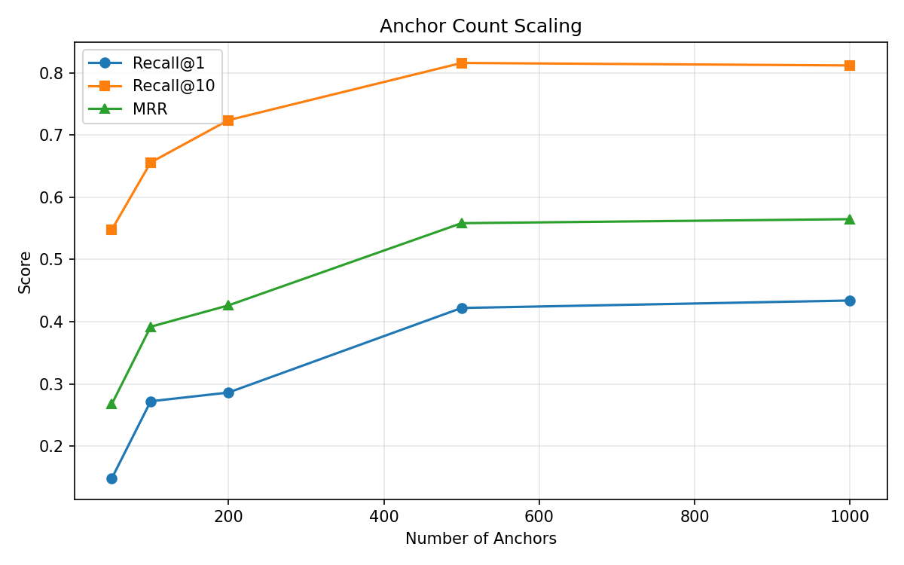
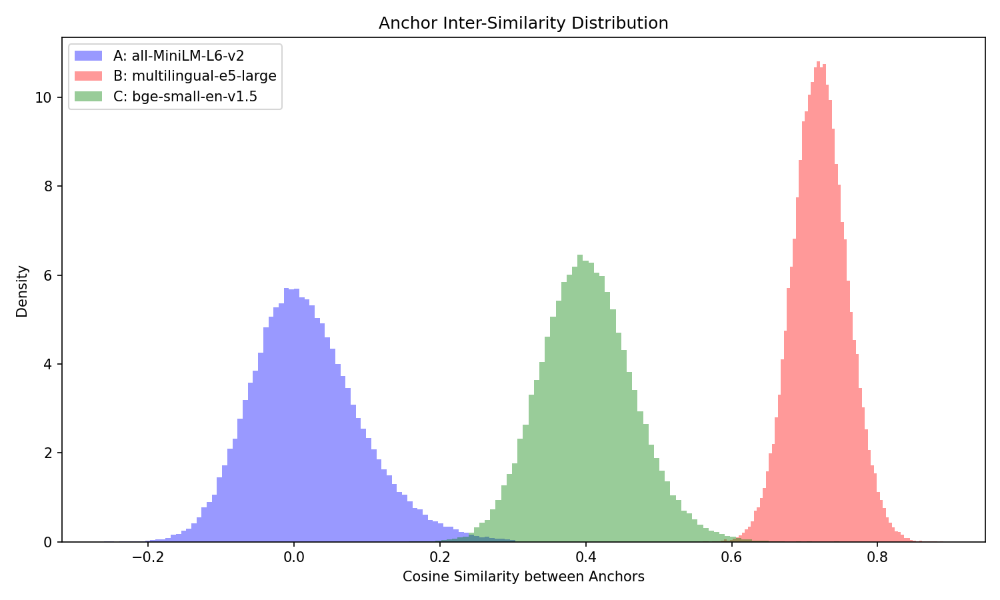
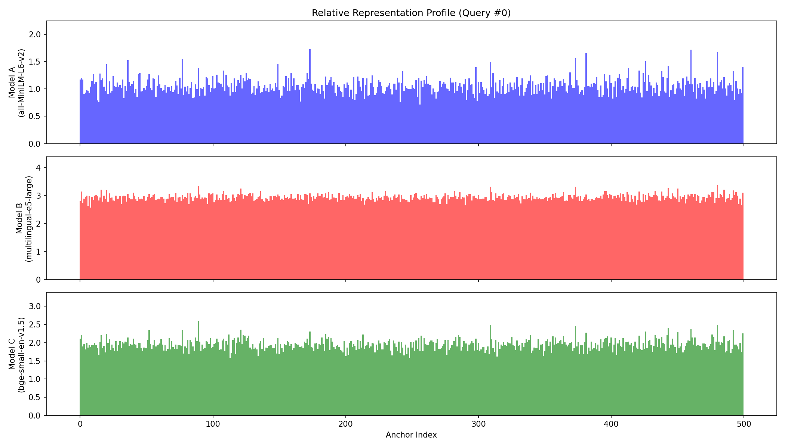
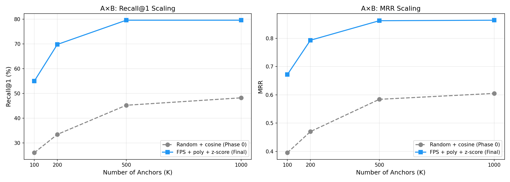
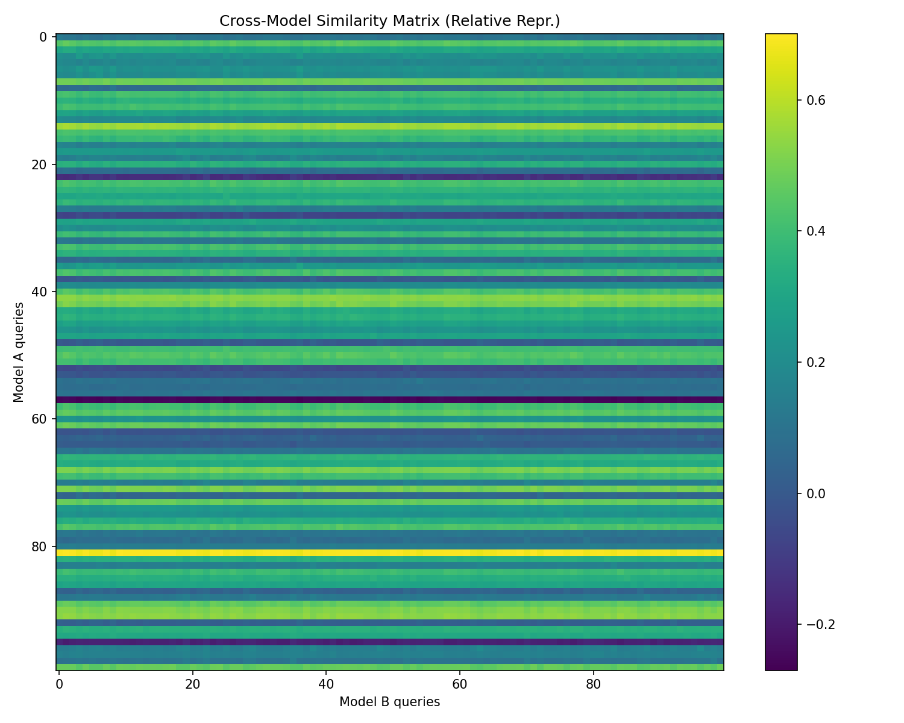
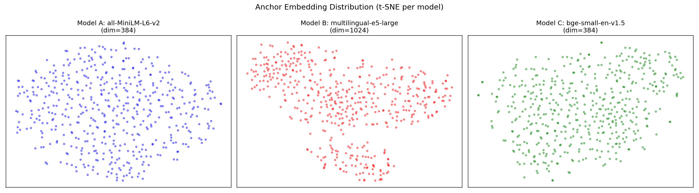
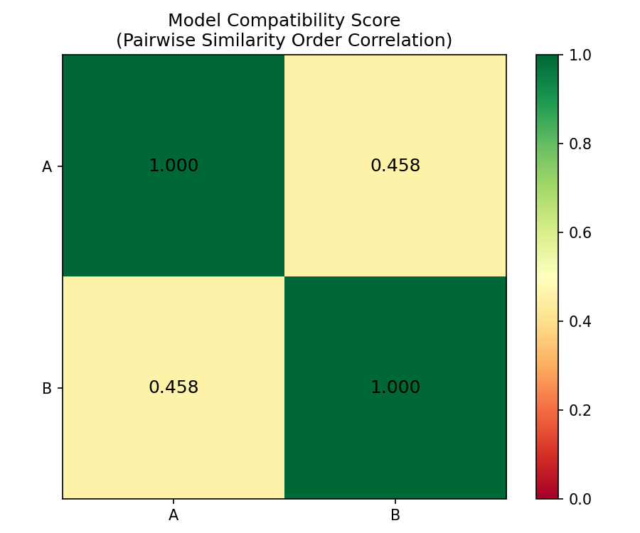

# Relative Anchor Translation (RAT)

異なるembeddingモデル間で、共通アンカーポイントとの相対距離だけを使い、**追加学習なしにzero-shot**で空間変換ができるかを検証する実験。

## RAT Protocol v0.1

実験を通じて確定した構成:

```
入力: 任意のembeddingモデルの出力ベクトル
出力: モデル非依存の500次元相対表現ベクトル

1. アンカー選定  → Farthest Point Sampling (K=500)
2. 相対表現変換  → 多項式カーネル (x·a + 1)²
3. 正規化       → z-score（DB側に適用。クエリ側は不要）
4. 検索         → コサイン類似度によるkNN
```

追加学習なし。CPU実行可能。新しいモデルの登録はアンカーをencodeするだけ。

### テキスト×テキスト（5モデル全ペア）

| ペア | Model X | Model Y | Recall@1 | Recall@10 | MRR |
|------|---------|---------|----------|-----------|-----|
| A×C | MiniLM (384d) | BGE-small (384d) | **98.0%** | 99.6% | 0.988 |
| A×E | MiniLM (384d) | BGE-large (1024d) | **80.2%** | 99.4% | 0.880 |
| A×B | MiniLM (384d) | E5-large (1024d) | **76.2%** | 96.8% | 0.844 |
| C×E | BGE-small (384d) | BGE-large (1024d) | **77.0%** | 99.4% | 0.851 |
| B×C | E5-large (1024d) | BGE-small (384d) | **64.0%** | 89.6% | 0.731 |
| B×E | E5-large (1024d) | BGE-large (1024d) | **55.2%** | 89.0% | 0.665 |

5モデル全10ペアでRecall@1 > 30%。ランダムベースライン(0.2%)の275倍以上。

**注目: B×E（同次元1024d）= 55% < A×B（異次元384d/1024d）= 76%。** 次元の一致は無関係。空間構造の互換性が本質。

### クロスモーダル: テキスト×画像（Phase 4）

| 方向 | Recall@1 | Recall@10 | MRR | 備考 |
|------|----------|-----------|-----|------|
| Text→Image (MiniLM→CLIP画像) | **16.4%** | 62.6% | 0.305 | ベースライン最良 |
| Image→Text (CLIP画像→MiniLM) | **18.2%** | 64.6% | 0.325 | z-score最良 |
| CLIP直接検索（参考上限） | 62.0% | 95.0% | 0.734 | 4億ペアで学習済み |

MiniLMは画像の存在を知らないテキスト専用モデル。CLIPの画像エンコーダはViTベースの画像専用アーキテクチャ。この2つの間に500組の(画像, テキスト)ペアアンカーを置いただけで、**追加学習ゼロでクロスモーダル検索が機能する**。

CLIPは画像とテキストを同じ空間に埋めるために4億ペアでcontrastive learningされている。RATは500個のペアアンカーだけでその対応を近似している。

## 仮説

Model Aで埋め込んだテキストを、アンカーとのコサイン類似度ベクトル（相対表現）に変換すれば、Model Bの相対表現空間で最近傍検索して正しい対応文を特定できる。

## 仕組み

### テキスト×テキスト

```
テキスト → Model A (384d) → (x·a+1)² → z-score → 相対表現 (500d)
テキスト → Model B (1024d) → (x·a+1)² → z-score → 相対表現 (500d)
                                                     ↑ 同じ空間
```

元の次元数が異なっていても、共通のK個のアンカーとの類似度プロファイルに変換することで、同一空間での比較が可能になる。

### クロスモーダル: ロゼッタストーン方式

```
                  ┌─ テキストアンカー ─┐     ┌─ 画像アンカー ─┐
                  │  500キャプション    │     │  500画像       │
                  │  (同じ概念ペア)    │     │  (同じ概念ペア) │
                  └────────┬──────────┘     └───────┬────────┘
                           │                        │
テキストクエリ → MiniLM → 相対表現 (500d)              │
                                    ↑ 同じ空間 ↑      │
画像クエリ   → CLIP画像 ─────────────────── 相対表現 (500d)
```

テキストモデルにはテキスト側を、画像モデルには画像側を通す。同じアンカーID=同じ概念。各モデルの「概念への反応パターン」がモダリティを跨いで一致することで、追加学習なしのクロスモーダル検索が可能になる。

## 使用モデル

| モデル | 次元数 | ラベル |
|--------|--------|--------|
| `sentence-transformers/all-MiniLM-L6-v2` | 384 | Model A（軽量英語特化） |
| `intfloat/multilingual-e5-large` | 1024 | Model B（多言語大規模） |
| `BAAI/bge-small-en-v1.5` | 384 | Model C（英語特化小型） |
| `sentence-transformers/clip-ViT-B-32` | 512 | Model D（CLIPテキストエンコーダ） |
| `BAAI/bge-large-en-v1.5` | 1024 | Model E（英語特化大型） |
| `openai/clip-vit-base-patch32` (画像) | 512 | CLIP画像エンコーダ（ViT-B/32） |

Model BとEは同じ1024次元だがアーキテクチャが異なる（XLM-R vs BERT）。直接cos類似度≈0（完全に無相関な空間）だが、RATで55%の検索精度を達成。

## 実験の経緯

### Phase 0: 仮説検証（ランダムアンカー + コサイン類似度）

最小構成で仮説が成立するかを検証。

| 実験 | Recall@1 | Recall@10 | MRR |
|------|----------|-----------|-----|
| Cross-Model A→B (K=500) | 42.2% | 81.6% | 0.558 |
| Random Baseline | 0.2% | - | - |

**判定: 仮説は成立。** ランダムアンカー500個でRecall@1=42.2%。スケーリングカーブはK=500で飽和傾向、アンカー数増加よりも選定最適化が次のレバー。



### Phase 1: アンカー選定 + カーネル最適化

4種のアンカー選定と3種のカーネル関数を独立に検証し、組み合わせ。

| アンカー選定 | カーネル | Recall@1 | Recall@10 | MRR |
|-------------|---------|----------|-----------|-----|
| ランダム | cosine | 43.2% | 79.2% | 0.552 |
| k-means | cosine | 49.2% | 86.8% | 0.614 |
| **FPS** | cosine | **66.4%** | 95.6% | 0.767 |
| 両モデル合議 | cosine | 50.6% | 88.4% | 0.625 |
| ランダム | poly | 58.2% | 88.0% | 0.687 |
| **FPS** | **poly** | **77.2%** | **97.2%** | **0.850** |

**FPS + poly で Recall@1: 43%→77%（+34pt）。**

- FPSが圧勝（+23pt）: 空間を最大限に散らすことで、ランダムアンカーの密集バイアスを解消
- 多項式カーネルが効く（+15pt）: `(x·a+1)²` で非線形性を入れることで、最上位の弁別力が向上
- 組み合わせで相乗効果

### Phase 2: 3モデルクロス検証 — B×Cの崩壊

FPS+polyプロトコルを3モデル全ペアで検証。**B×Cが15%で崩壊。**

| ペア | Recall@1 | 判定 |
|------|----------|------|
| A×B (MiniLM × E5-large) | 79.4% | PASS |
| A×C (MiniLM × BGE-small) | 98.4% | PASS |
| B×C (E5-large × BGE-small) | 15.2% | **FAIL** |

FPSの基準モデルを変えても、TF-IDF FPSやブートストラップFPSを試しても改善せず。**アンカー選定の問題ではない**ことが判明。

### 原因分析: E5-largeの類似度潰れ



| Model | アンカー間Mean Sim | Range | Entropy |
|-------|-------------------|-------|---------|
| A (MiniLM) | 0.018 | [-0.26, 0.30] | **2.04** |
| B (E5-large) | **0.721** | **[0.56, 0.89]** | **1.40** |
| C (BGE-small) | 0.402 | [0.15, 0.75] | 1.90 |

**E5-large空間ではアンカー同士が全て互いに類似している（mean=0.72, 有効レンジわずか0.33）。** 多言語対応のために広い意味空間を共有空間にマッピングした結果、英語テキスト同士の類似度が全体的に底上げされ、狭いレンジに圧縮されている。相対表現プロファイルがフラットになり、弁別力が消滅する。

A×Bが動くのはModel A側の高エントロピーな相対表現（entropy=2.04）が検索を牽引しているから。B×CではB側の低エントロピー表現がボトルネックとなり崩壊する。



同一文に対する3モデルの相対表現プロファイル。Model B（E5-large）のプロファイルがフラットで弁別力に欠ける。

### Phase 3: z-score正規化で解決

類似度の分布が潰れているなら、後処理で引き伸ばせばいい。4つの手法を検証。

| 手法 | B×C R@1 | A×B R@1 | A×C R@1 |
|------|---------|---------|---------|
| ベースライン | 14.4% | 77.6% | 97.8% |
| **z-score正規化** | **64.0%** | **76.2%** | **98.0%** |
| ランク変換 | 52.0% | 67.2% | 97.6% |
| Top-kマスク (k=50) | 50.2% | 54.0% | 83.0% |
| 温度softmax (T=0.1) | 50.2% | 34.6% | 44.8% |

**z-score正規化が圧勝。B×C: 14.4%→64.0%（+49.6pt）で60%突破。A×B/A×Cへの悪影響はほぼゼロ。**

z-scoreが最良である理由: 「潰れていれば広げ、広がっていればほぼそのまま」という性質。ランク変換は類似度の絶対的な差の大きさを捨ててしまう。Top-kとsoftmaxは潰れていないモデルの情報を破壊する。z-scoreだけが全モデルに対して安全。

### 設計知見

情報量が足りないときの対策は「情報を捨てる変換」（ランク、Top-k）ではなく「情報を引き伸ばす変換」（z-score）であるべき。

### Phase 4: クロスモーダル（テキスト×画像）

#### Step 1: CLIPテキストエンコーダ vs Sentence-BERT

CLIPのテキストエンコーダ（contrastive learningで学習）がRAT相対表現でSentence-BERTと互換性を持つか検証。

| ペア | Recall@1 | Recall@10 | MRR |
|------|----------|-----------|-----|
| C×D (BGE × CLIP-text) | **32.0%** | 66.4% | 0.441 |
| A×D (MiniLM × CLIP-text) | 24.0% | 59.0% | 0.357 |
| B×D (E5-large × CLIP-text) | 7.8% | 33.4% | 0.162 |

CLIPテキスト空間はentropy=2.60で全モデル最高だが、Recall@1は低い。**弁別力はあるが、テキスト間の意味構造がSBERT系と根本的に違う。** CLIPはテキストを「画像と対応づけるための表現」として学習しており、テキスト同士の細かい意味的距離関係は二の次。

B×D=7.8%が崩壊するのは、E5-large（entropy=1.40）とCLIPの両方に偏りがあるため。

#### Step 2: テキスト×画像（ロゼッタストーン方式）

COCO Captionsから(画像, キャプション)のペアをアンカーとし、テキストモデルにはキャプションを、画像モデルには画像を通す。同じアンカーID=同じ概念。

| 方向 | Method | Recall@1 | Recall@10 | MRR |
|------|--------|----------|-----------|-----|
| Text→Image | baseline | **16.4%** | 62.6% | 0.305 |
| Text→Image | z-score | 15.6% | 60.4% | 0.297 |
| Image→Text | baseline | 3.8% | 23.8% | 0.110 |
| Image→Text | z-score | **18.2%** | 64.6% | 0.325 |
| CLIP直接検索（参考） | — | 62.0% | 95.0% | 0.734 |

**MiniLM（テキスト専用）から、追加学習なしでCLIPの画像検索空間にアクセスできることを実証。**

#### z-scoreの非対称効果

Phase 3の知見がモダリティを跨いで再現された:

- **Text→Image**: z-scoreで微減（16.4%→15.6%）。MiniLM側はentropy=2.42で十分広がっており、z-scoreは余計
- **Image→Text**: z-scoreで大幅改善（3.8%→18.2%）。CLIP画像空間（mean sim=0.47）が潰れている側がクエリのとき、z-scoreが劇的に効く

**「潰れている側がクエリのときにz-scoreが効く」という法則が、テキスト×テキストでもクロスモーダルでも成立する。**

### 追加実験: 論文化に向けた検証

#### C-1: データセット非依存性の検証

STSBenchmark以外のデータセット（AllNLI test split, 26K文）で同プロトコルを検証。

| ペア | STSBenchmark R@1 | AllNLI R@1 | 差分 |
|------|-----------------|-----------|------|
| A×B | 76.2% | 71.8% | -4.4% |
| A×C | 98.0% | 99.2% | +1.2% |
| B×C | 64.0% | **84.2%** | **+20.2%** |

全ペアで30%超、プロトコルのデータセット非依存性を確認。B×Cが大幅改善（+20%）したのは、NLIの多様な文がz-scoreの正規化効果をより引き出すため。

#### C-2: スケーリングカーブ — FPSの定量的貢献

A×Bペアで「ランダム+cosine（Phase 0）」vs「FPS+poly+z-score（最終プロトコル）」を比較。

| K | Random+cosine | FPS+proto | FPSの貢献 |
|---|--------------|-----------|----------|
| 100 | 26.0% | **55.0%** | +29.0% |
| 200 | 33.4% | **69.8%** | +36.4% |
| 500 | 45.2% | **79.6%** | +34.4% |
| 1000 | 48.2% | **79.6%** | +31.4% |



**FPS+proto K=100（55%）> Random K=1000（48%）。** 適切なアンカー選定とカーネルがあれば、10分の1のアンカー数で上の性能。K=500→1000で飽和し、K=500がコスト最適。

#### C-3: 非対称z-score — DB側適用の発見

z-scoreを「クエリ側のみ」「DB側のみ」「両方」「なし」の4パターンで全ペアを検証。

| ペア | none | query_only | db_only | both |
|------|------|-----------|---------|------|
| A×B | 80.6% | 72.0% | **81.0%** | 81.0% |
| A×C | 98.0% | 90.2% | **98.2%** | 98.2% |
| B×C | 8.4% | 52.8% | **73.4%** | 73.4% |
| Text→Image | **16.4%** | 8.2% | 15.6% | 15.6% |
| Image→Text | 3.8% | 10.0% | **18.2%** | 18.2% |

**全ペア・全方向で `db_only` = `both`。** z-scoreはDB側に適用するのが本質で、クエリ側は不要（むしろ有害: A×Bで-9%, A×Cで-8%）。

エントロピー閾値による自動判定（entropy < 2.0側にのみ適用）は方向依存を扱えず不適切。**「常にDB側にz-score」が最も単純で堅牢なルール。**

#### C-4: 大モデル追加 — 次元の無関係性

Model E（BGE-large, 1024d）を追加し、「次元ではなく空間構造が重要」を検証。

| ペア | 次元 | R@1 | 注目点 |
|------|------|-----|--------|
| A×E | 384×1024 | **80.2%** | 異次元、高性能 |
| C×E | 384×1024 | **77.0%** | BGE同族でも完全一致ではない |
| B×E | 1024×1024 | **55.2%** | 同次元なのに低い |

B（E5-large）とE（BGE-large）は同じ1024次元で、直接cos類似度≈0（完全に無相関な空間）。にもかかわらずRATで55%の検索精度を達成。**絶対座標が完全に無相関でも、アンカーとの相対距離パターンには共有構造がある。**

同次元B×E（55%）< 異次元A×B（76%）が示す通り、次元の一致/不一致はRAT性能に無関係。空間の意味的構造の類似性が決定要因。

## 制限事項と今後

- テキスト×テキストは英語（STSBenchmark, AllNLI）のみ検証。多言語・クロスリンガルは未検証
- アンカー数K=500は英語STSスケールでの最適値。大規模コーパスではスケーリングが必要な可能性
- クロスモーダルはproof of conceptの段階。アンカー数・カーネルの最適化はテキスト×テキストほど検証が進んでいない
- 画像側のFPS最適化が未着手（現在はテキスト空間でFPS）

## 可視化

### Phase 0

| | |
|---|---|
|  |  |
| 類似度行列ヒートマップ | アンカー数スケーリング |

### 原因分析

| | |
|---|---|
|  |  |
| アンカーembedding分布（モデル別） | アンカー間類似度分布 |



## 実行方法

```bash
python3 -m venv .venv
source .venv/bin/activate
pip install -r requirements.txt

python experiments/run_phase0.py      # Phase 0: 仮説検証
python experiments/run_phase1.py      # Phase 1: 最適化
python experiments/run_phase2.py      # Phase 2: 3モデル検証
python experiments/run_phase2b.py     # Phase 2b: FPS基準診断
python experiments/run_analysis.py    # 原因分析
python experiments/run_phase3.py      # Phase 3: 潰れ対策
python experiments/run_phase4_step1.py  # Phase 4-1: CLIP text vs SBERT
python experiments/run_phase4_step2.py  # Phase 4-2: クロスモーダル検索
python experiments/run_c1_sick.py       # C-1: AllNLIでの再現
python experiments/run_c2_scaling.py    # C-2: スケーリングカーブ比較
python experiments/run_c3_asymmetric_zscore.py  # C-3: 非対称z-score
python experiments/run_c4_large_model.py  # C-4: 大モデル追加
```

## ディレクトリ構成

```
rat-experiment/
├── config.py                    # 実験パラメータ一元管理
├── src/
│   ├── anchor_sampler.py        # アンカー選定（Random, k-means, FPS, TF-IDF, Bootstrap）
│   ├── embedder.py              # マルチモデルembedding（プレフィクス自動管理）
│   ├── relative_repr.py         # 相対表現変換（cosine, RBF, poly） + 正規化（z-score等）
│   ├── evaluator.py             # Recall@K, MRR, Overlap@10
│   └── visualizer.py            # 可視化
├── experiments/
│   ├── run_phase0.py            # Phase 0: 仮説検証
│   ├── run_phase1.py            # Phase 1: 最適化
│   ├── run_phase2.py            # Phase 2: 3モデル検証
│   ├── run_phase2b.py           # Phase 2b: FPS基準診断
│   ├── run_analysis.py          # B×C原因分析
│   ├── run_phase3.py            # Phase 3: 潰れ対策
│   ├── run_phase4_step1.py      # Phase 4: CLIPテキスト vs SBERT
│   ├── run_phase4_step2.py      # Phase 4: クロスモーダル検索
│   ├── run_c1_sick.py           # C-1: AllNLIでの再現
│   ├── run_c2_scaling.py        # C-2: スケーリングカーブ比較
│   ├── run_c3_asymmetric_zscore.py  # C-3: 非対称z-score
│   └── run_c4_large_model.py    # C-4: 大モデル追加
├── data/                        # 実行時に自動生成（git非追跡）
└── results/                     # 評価結果・可視化
```

## License

MIT
