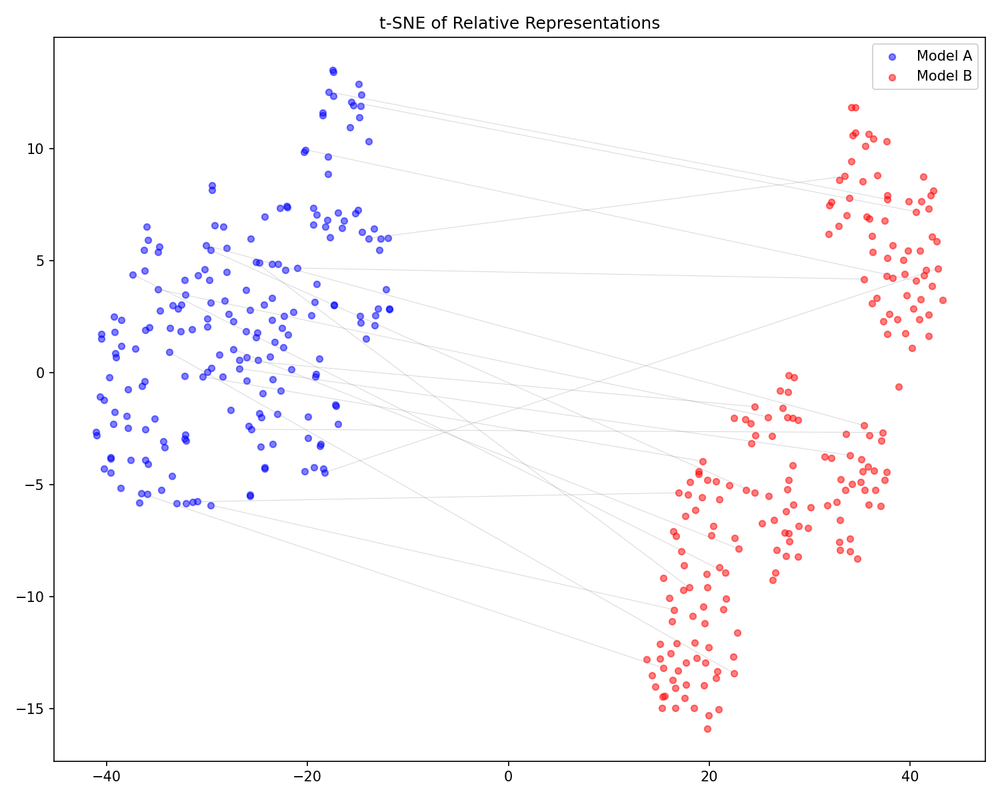

# Relative Anchor Translation (RAT)

異なるembeddingモデル間で、共通アンカーポイントとの相対距離だけを使い、追加学習なしにzero-shotで空間変換ができるかを検証する実験。

## 仮説

Model Aで埋め込んだテキストを、アンカーとのコサイン類似度ベクトル（相対表現）に変換すれば、Model Bの相対表現空間で最近傍検索して正しい対応文を特定できる。

## 仕組み

```
テキスト → Model A (384d) → アンカーとのcos sim → 相対表現 (K次元)
テキスト → Model B (1024d) → アンカーとのcos sim → 相対表現 (K次元)
                                                     ↑ 同じ空間
```

元の次元数が異なっていても、共通のK個のアンカーとの類似度プロファイルに変換することで、同一空間での比較が可能になる。

## 使用モデル

| モデル | 次元数 | ラベル |
|--------|--------|--------|
| `sentence-transformers/all-MiniLM-L6-v2` | 384 | Model A（軽量英語特化） |
| `intfloat/multilingual-e5-large` | 1024 | Model B（多言語大規模） |
| `BAAI/bge-small-en-v1.5` | 384 | Model C（英語特化） |

## 結果サマリ

### Phase 0: 仮説検証（ランダムアンカー + コサイン類似度）

| 実験 | Recall@1 | Recall@10 | MRR |
|------|----------|-----------|-----|
| Cross-Model A→B (K=500) | 42.2% | 81.6% | 0.558 |
| Cross-Model A→B (K=1000) | 43.4% | 81.2% | 0.565 |
| Random Baseline | 0.2% | - | - |

**判定: 仮説は成立。** ランダムアンカー500個でRecall@1=42.2%（ランダムベースライン0.2%の200倍以上）。

### Phase 1: アンカー選定 + カーネル最適化

| アンカー選定 | カーネル | Recall@1 | Recall@10 | MRR |
|-------------|---------|----------|-----------|-----|
| ランダム | cosine | 43.2% | 79.2% | 0.552 |
| k-means | cosine | 49.2% | 86.8% | 0.614 |
| **FPS** | cosine | **66.4%** | 95.6% | 0.767 |
| 両モデル合議 | cosine | 50.6% | 88.4% | 0.625 |
| ランダム | rbf | 33.2% | 66.4% | 0.440 |
| ランダム | poly | 58.2% | 88.0% | 0.687 |
| **FPS** | **poly** | **77.2%** | **97.2%** | **0.850** |

**FPS（Farthest Point Sampling）+ 多項式カーネル `(x·a+1)²` で Recall@1: 43%→77%（+34pt）。**

- FPSが圧勝（+23pt）: 空間を最大限に散らすことで、ランダムアンカーの密集バイアスを解消
- 多項式カーネルが効く（+15pt）: 二乗で非線形性を入れることで、最上位の弁別力が向上
- 組み合わせで相乗効果: 個別の改善を超える+34ptの改善

### Phase 2: 3モデルクロス検証

FPS+polyプロトコルを3モデル全ペアで検証。

| ペア | Model X | Model Y | Recall@1 | Recall@10 | MRR |
|------|---------|---------|----------|-----------|-----|
| A×B | MiniLM | E5-large | **79.4%** | 98.4% | 0.864 |
| A×C | MiniLM | BGE-small | **98.4%** | 99.6% | 0.990 |
| B×C | E5-large | BGE-small | **15.2%** | 52.2% | 0.312 |

**A×B, A×Cは目標達成。B×Cは失敗。** この非対称性の原因を分析した（後述）。

## B×C失敗の原因分析

### アンカー間類似度の崩壊


| Model | アンカー間Mean Sim | Range | Entropy |
|-------|-------------------|-------|---------|
| A (MiniLM) | 0.018 | [-0.26, 0.30] | **2.04** |
| B (E5-large) | **0.721** | **[0.56, 0.89]** | **1.40** |
| C (BGE-small) | 0.402 | [0.15, 0.75] | 1.90 |

**E5-large空間ではアンカー同士が全て互いに類似している（mean=0.72, range=0.56〜0.89）。** FPSで最大限散らしても、E5-large空間での分散は極めて小さい。結果として相対表現プロファイルがフラットになり、弁別力が消滅する。

### なぜA×Bは動くのか

| ペア | 構造互換性 (Spearman ρ) | 相対表現相関 | Recall@1 |
|------|----------------------|------------|----------|
| A×B | 0.458 | 0.385 | 79.4% |
| A×C | 0.551 | 0.532 | 98.4% |
| B×C | 0.466 | 0.485 | **15.2%** |

B×Cの構造互換性(0.466)はA×B(0.458)とほぼ同等。相対表現相関(0.485)はA×Bより高い。**にもかかわらずRecall@1は15%。**

これは**モデルペアの互換性の問題ではなく、E5-largeの相対表現自体の情報量の低さ**が原因。A×Bが動くのはModel A側の高エントロピーな相対表現（entropy=2.04）が検索を牽引しているため。B×CではB側の低エントロピー表現（entropy=1.40）がボトルネックとなり検索が崩壊する。

### 互換性スコア


### 結論

RATの性能は**モデルペアの構造的類似度**ではなく、**各モデルのアンカー類似度分布のエントロピー**に依存する。アンカーに対する類似度プロファイルが十分に分散している（高エントロピー）モデル同士のペアでは高精度が期待できるが、アンカー類似度が潰れるモデル（E5-largeのような高次元多言語モデル）が両側にいないペアでは機能しない。

## 可視化

### Phase 0

| | |
|---|---|
|  |  |
| 類似度行列ヒートマップ | アンカー数スケーリング |



### 原因分析

| | |
|---|---|
|  |  |
| アンカーembedding分布（モデル別） | アンカー間類似度分布 |


同一文に対する3モデルの相対表現プロファイル。Model B（E5-large）のプロファイルがフラットで弁別力に欠けることが視覚的に確認できる。

## 実行方法

```bash
python3 -m venv .venv
source .venv/bin/activate
pip install -r requirements.txt

# Phase 0: 基本仮説検証
python experiments/run_phase0.py

# Phase 1: アンカー選定 + カーネル最適化
python experiments/run_phase1.py

# Phase 2: 3モデルクロス検証
python experiments/run_phase2.py

# Phase 2b: FPS基準モデル依存性の診断
python experiments/run_phase2b.py

# 原因分析
python experiments/run_analysis.py
```

## ディレクトリ構成

```
rat-experiment/
├── config.py                    # 実験パラメータ一元管理
├── src/
│   ├── anchor_sampler.py        # アンカー選定（Random, k-means, FPS, TF-IDF, Bootstrap）
│   ├── embedder.py              # マルチモデルembedding（プレフィクス自動管理）
│   ├── relative_repr.py         # 相対表現変換（cosine, RBF, poly kernel）
│   ├── evaluator.py             # Recall@K, MRR, Overlap@10
│   └── visualizer.py            # 可視化
├── experiments/
│   ├── run_phase0.py            # Phase 0: 仮説検証
│   ├── run_phase1.py            # Phase 1: 最適化
│   ├── run_phase2.py            # Phase 2: 3モデル検証
│   ├── run_phase2b.py           # Phase 2b: FPS基準診断
│   └── run_analysis.py          # B×C原因分析
├── data/                        # 実行時に自動生成（git非追跡）
└── results/                     # 評価結果・可視化
```

## License

MIT
